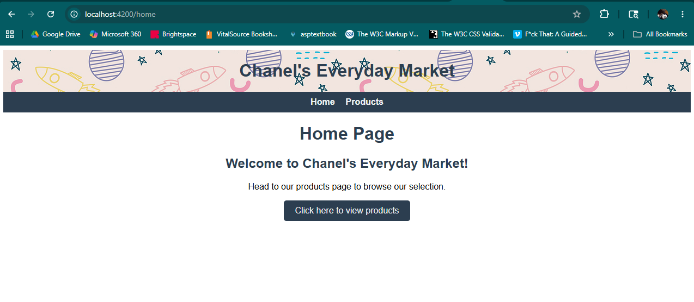
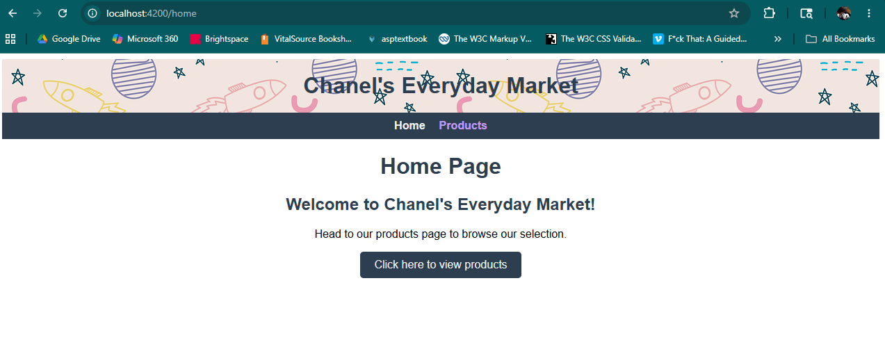
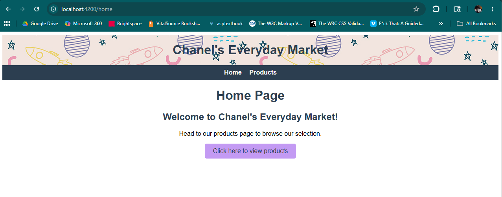
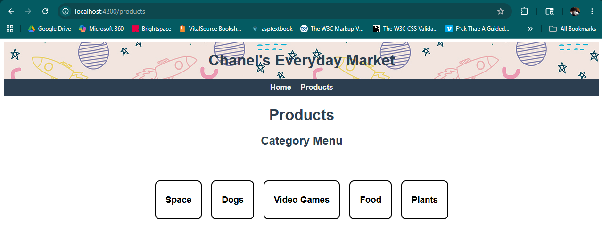
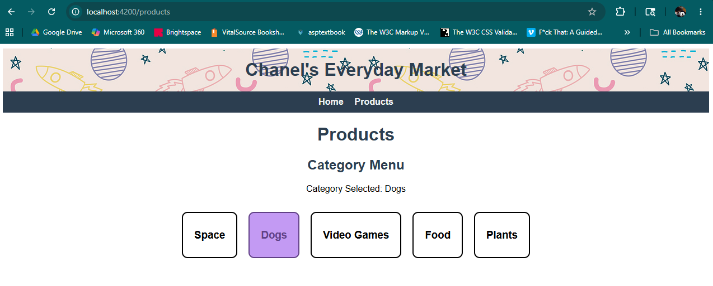

# Module 1 Assignment: Everyday Market App - Angular
by Chanel Cannon
completed May 20, 2026

This project was generated using [Angular CLI](https://github.com/angular/angular-cli) version 21.2.11.

This project was created using the help of GitHub Copilot AI Assistant.

Space pattern found at: [https://pixabay.com/vectors/space-astronomy-spaceships-5654794/](https://pixabay.com/vectors/space-astronomy-spaceships-5654794/)

## Introduction
An "Everyday Market App" application made using Angular and Angular CLI to show use of components, data binding (specifically property and event binding), managment of state and component interaction (using @Input(), @Output, and EventEmitter), and application of Angular control flow syntax (using @for and @if).

## Table of Contents
- [Requirements]
- [How it Works]
  - [Parent Product Page - Child Category Menu]
  - [Parent Category Menu - Child Category Menu Item]
- [Testing]
	- [Development Server]
  - [Home Page]
  - [Products Page]
- [References]
- [PS]
  - [1]
  - [2 🧋]

## Requirements
- Node.js
- Angular CLI
- an IDE (I used Visual Studio Code) with integrated terminal

## How it Works
The application has a global component `Header` with a background image and a navbar, and two page components, `Home` and `Products Page`.

On the `Products Page` page, the focus of this assignment, you will see five categories. These are the `Category Menu Items` components which are bound to the overall `Category Menu`, which is bound to the `Products Page`.

The `Category` interface provides a template for `Category` objects.

### Parent Product Page - Child Category Menu
#### How these components are bound:
`products-page.ts` contains the `categories` array with five `Category` objects.

`category-menu.ts` inputs this list from it's parent via:
```TypeScript
@Input() categories: Category[] = [];
```

`category-menu.ts` outputs the selected `Category` via:
```TypeScript
@Output() selected = new EventEmitter<Category>();
```

`products-page.html` is bound to it's child via property binding:
```Typescript
<app-category-menu [categories]="categories"></app-category-menu>
```

### Parent Category Menu - Child Category Menu Item
#### How these components are bound:
`category-menu.html` supplies each `Category` item `name` in the `categories` array to it's child via the property binding `categoryName` and looping through the array with a control flow `@for`:
```HTML
<div class="categories-grid">
  <ul>
  @for (category of categories; track category.name) {
    <li>
      <app-category-menu-item
        [categoryName]="category.name"
        (click)="onCategorySelected(category.name)">
      </app-category-menu-item>
    </li>
  }
  </ul> 
</div>
```
`category-menu-item.ts` inputs this string from it's parent via:
```TypeScript
@Input() categoryName: string = '';
```
`category-menu-item.html` uses `categoryName` as a variable to print an h3 subheader within that category's box.
```HTML
<div class="category-menu-item" (click)="onItemClick()">
  <h3>{{ categoryName }}</h3>
</div>
```
`category-menu-item.ts` outputs the clicked category name to it's parent via:
```TypeScript
@Output() click = new EventEmitter<string>();

onItemClick() {
  this.click.emit(this.categoryName);
}
```

## Testing
### Development Server
To start a local development server, run:

```bash
ng serve
```

Once the server is running, open your browser and navigate to `http://localhost:4200/`.

### Build
Create a production build
```bash
ng build
```

### Test
Run the unit tests
```bash
ng test
```

### Home Page
Once you have navigated to the local server, the application will load the `Home` page:


From here, there are two options that Route to the `Products Page` page, via the Nav Bar:


Or via a button I decided to add for UI (and for fun!):


### Products Page
Once you have navigated to the `Products Page` page, it will load as shown here:


You can then test the Event tracking by parent `Category Menu` of child `Category Menu Item` by clicking on a category box (a `Category Menu Item` component) and seeing that `Category Menu` creates a notification of which category box was clicked:


## References
I used the instructions from Practice Activities 1, 2, and 3 extensively. They were extremely helpful!

## PS
### 1
I realized in my screenshots I had a bookmark bar item that contained a strange link, rather than remove it and redo the screenshots, I decided to include the link here in hopes you enjoy:
[`F*ck That: An Honest Meditation` by Jason Headley](https://vimeo.com/132790897)
***Note: that this contains many swears

### 2 🧋
I also enjoy homemade fruit juice bubble tea with popping bubbles (and my husband, milk tea with tapioca pearls)! We make it at home now too to save money 😊
